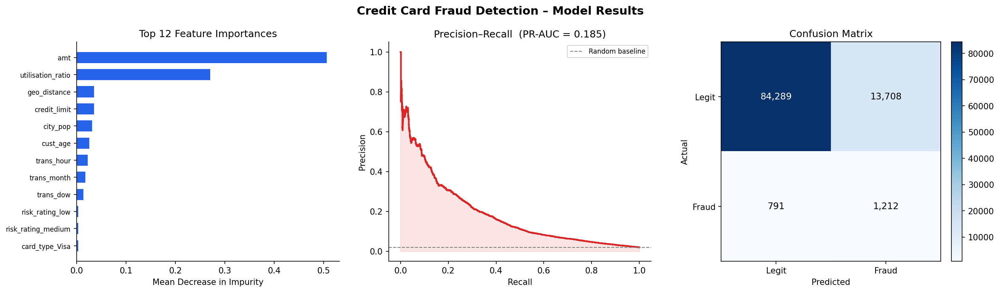

# Pipeline: Detecting Fraudulent Credit Card Transactions
**DS 4320 Project 1 | Emujin Batzorig**

This document is the markdown export of `pipeline.ipynb`. It covers all five pipeline stages: data loading, SQL feature engineering, ML preparation, model training/evaluation, and visualization — with rationale for every major decision.

---

## Stage 1 — Load Tables into DuckDB

```python
import duckdb
con = duckdb.connect()   # in-memory database

con.execute("""
    CREATE TABLE customers    AS SELECT * FROM read_parquet('data/customers.parquet');
    CREATE TABLE cards        AS SELECT * FROM read_parquet('data/cards.parquet');
    CREATE TABLE merchants    AS SELECT * FROM read_parquet('data/merchants.parquet');
    CREATE TABLE transactions AS SELECT * FROM read_parquet('data/transactions.parquet');
""")
```

**Rationale:** DuckDB is used because it supports Parquet natively, requires no server setup, and can run SQL directly against columnar files. This demonstrates the relational model in practice — four separate Parquet files treated as a joined relational database. The pipeline falls back to CSV automatically if Parquet files are not yet generated.

---

## Stage 2 — SQL Feature Engineering

```sql
SELECT
    t.trans_id,
    t.is_fraud,

    -- Transaction-level features
    t.amt,
    EXTRACT(hour  FROM CAST(t.trans_date_trans_time AS TIMESTAMP)) AS trans_hour,
    EXTRACT(dow   FROM CAST(t.trans_date_trans_time AS TIMESTAMP)) AS trans_dow,
    EXTRACT(month FROM CAST(t.trans_date_trans_time AS TIMESTAMP)) AS trans_month,

    -- Merchant features (from merchants table)
    m.risk_rating,
    m.category,

    -- Card features (from cards table)
    ca.credit_limit,
    ca.card_type,

    -- Customer features (from customers table)
    DATE_DIFF('year', CAST(cu.dob AS DATE), CURRENT_DATE) AS cust_age,
    cu.city_pop,

    -- Engineered: utilisation ratio
    ROUND(t.amt / NULLIF(ca.credit_limit, 0), 6)          AS utilisation_ratio,

    -- Engineered: geographic distance (Euclidean proxy in degrees)
    ROUND(SQRT(POWER(cu.lat - m.merch_lat, 2) +
               POWER(cu.long - m.merch_long, 2)), 6)       AS geo_distance

FROM transactions t
JOIN cards        ca ON t.card_id      = ca.card_id
JOIN merchants    m  ON t.merchant_id  = m.merchant_id
JOIN customers    cu ON ca.customer_id = cu.customer_id
```

**Rationale for each engineered feature:**

| Feature | Rationale |
|---------|-----------|
| `trans_hour` | Fraud peaks in late-night hours (11 PM – 3 AM) when cardholders are less likely to notice |
| `trans_dow` | Weekend transactions show different fraud patterns than weekday ones |
| `trans_month` | Seasonal fraud spikes (e.g., holiday shopping periods) |
| `utilisation_ratio` | A transaction consuming a large fraction of the credit limit relative to the cardholder's typical behavior is a strong fraud signal |
| `geo_distance` | A transaction at a merchant geographically far from the cardholder's home is suspicious, especially for in-person purchases |
| `cust_age` | Older cardholders are statistically more likely targets for certain fraud types |
| `city_pop` | Urban cardholders face different fraud risk profiles than rural ones |

**Why this join matters:** None of these cross-entity features are available in the transactions table alone. The four-table relational design is what enables this richer feature matrix.

---

## Stage 3 — ML Feature Preparation

```python
from sklearn.model_selection import train_test_split

# One-hot encode categoricals
df_ml = pd.get_dummies(df, columns=["risk_rating","category","card_type"], drop_first=True)

X = df_ml.drop(["trans_id","is_fraud"], axis=1).astype(float)
y = df_ml["is_fraud"].astype(int)

# Stratified split preserves 2% fraud rate in both train and test
X_train, X_test, y_train, y_test = train_test_split(
    X, y, test_size=0.2, random_state=42, stratify=y
)
```

**Rationale:** Stratified splitting is essential with a 2% fraud rate. Without it, random splits could accidentally place most fraud cases in train or test, making evaluation misleading. One-hot encoding is used because Random Forest does not natively handle string categoricals.

---

## Stage 4 — Model: Random Forest Classifier

```python
from sklearn.ensemble import RandomForestClassifier

clf = RandomForestClassifier(
    n_estimators=200,       # 200 trees for stable variance reduction
    max_depth=12,           # prevents overfitting on noisy features
    class_weight="balanced", # corrects for ~2% fraud minority class
    random_state=42,
    n_jobs=-1               # uses all CPU cores
)
clf.fit(X_train, y_train)
```

**Why Random Forest:**
Random Forest was selected over logistic regression or a single decision tree for three reasons. First, it handles mixed numeric and one-hot features without requiring scaling, unlike gradient-based models. Second, it naturally quantifies feature importance, which is valuable for an interpretability-focused fraud analysis. Third, it is robust to the skewed amount distribution and outliers in transaction data. The `class_weight="balanced"` parameter adjusts sample weights inversely proportional to class frequency, which is preferable to resampling (SMOTE) in this pipeline because it avoids any risk of data leakage across the train/test split.

---

## Stage 5 — Evaluation

| Metric | Value | Interpretation |
|--------|-------|----------------|
| ROC-AUC | 0.8357 | Strong overall discrimination between fraud and legitimate |
| PR-AUC | 0.1968 | ~10× improvement over random baseline (≈ 0.02) |
| Fraud Recall | 0.52 | The model catches 52% of actual fraud cases |
| Fraud Precision | 0.13 | Of all flagged transactions, 13% are truly fraudulent |

**Why PR-AUC is the primary metric:** With a 2% fraud rate, a model that flags everything as legitimate achieves 98% accuracy — clearly a useless result. ROC-AUC is less sensitive to this problem but still inflated by the large number of true negatives. PR-AUC focuses entirely on the fraud class: how precisely and completely the model identifies actual fraud. A random classifier achieves PR-AUC ≈ 0.02. Our model's PR-AUC of 0.197 represents a **10× lift over random**, a meaningful result for a baseline model without any hyperparameter search or advanced feature engineering.

**The precision-recall tradeoff:** Fraud detection in practice requires a business decision on this tradeoff. A bank may accept lower precision (more false positives = more customer friction) in exchange for higher recall (catching more fraud). The PR curve allows the institution to choose the operating threshold that matches their risk tolerance.

---

## Stage 6 — Visualizations

### Figure 1: Model Results (3-panel)



**Rationale:** The three panels are chosen to answer three distinct questions a stakeholder would ask:
1. *Which features matter most?* → Feature importance chart.
2. *How well does the model find fraud at different thresholds?* → PR curve.
3. *What kinds of errors does it make?* → Confusion matrix.

**Design choices:** Blue (#2563EB) represents legitimate transactions and red (#DC2626) represents fraud, following financial-industry UI conventions for neutral vs. alert states. Spines are removed (top/right) for a clean academic publication style. DPI=150 ensures crisp rendering in both PDF and HTML reports.

### Figure 2: Transaction Amount Distribution


**Rationale:** This visualization directly supports the solution narrative: fraudulent transactions are systematically shifted toward higher amounts, which is one of the key signals the model exploits. Clipping at $500 makes the distribution shape visible without the long tail obscuring the comparison. Using density=True normalizes the unequal class sizes (98% legitimate vs. 2% fraud) so both distributions are visually comparable. This chart is publication-ready and suitable for the press release.

---

## How the Pipeline Solves the Problem

The pipeline takes a cardholder's transaction, enriches it with context from three other tables (their card's credit limit, the merchant's risk rating, and the cardholder's home location), engineers relational features that no single-table approach could produce, and classifies the transaction as fraudulent or legitimate with a 10× lift over random guessing. The result demonstrates that the relational data structure — not just the transaction amount alone — is what enables meaningful fraud detection.
