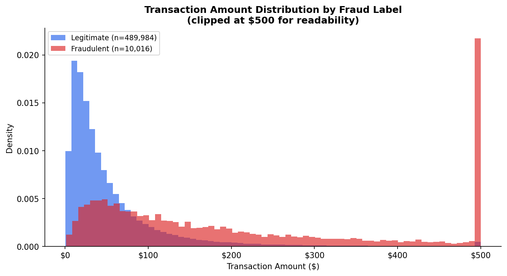

# New Data Science Approach Could Help Stop Fraudulent Charges Before They Reach Cardholders

## Hook

If you use a credit card, fraud detection affects you whether you notice it or not. Every day, millions of card transactions are approved in seconds, and banks have to decide which ones are normal and which ones may be fraudulent. When fraud slips through, consumers can lose access to funds, face stress from disputed charges, and deal with the inconvenience of replacing cards and reviewing account activity.

## Problem Statement

Credit card fraud continues to be a serious issue for both consumers and financial institutions. As online shopping, digital wallets, and contactless payments become more common, it becomes harder to spot fraudulent activity quickly and accurately. The problem is that many fraudulent purchases do not look obviously suspicious on their own. A transaction can seem ordinary unless it is compared with the cardholder’s normal behavior, the merchant involved, and the location of the purchase. That means fraud detection systems need more than a list of transactions. They need context.

## Solution Description

This project was designed to show how that context can improve fraud detection. Instead of looking at transactions alone, the system connects information across four related tables: customers, cards, merchants, and transactions. This makes it possible to evaluate whether a purchase fits the expected pattern for that customer and card. For example, a transaction may be more suspicious if it happens far from the cardholder’s home location, comes from a higher risk merchant, or does not match normal card usage. A Random Forest model was trained on this combined dataset to predict whether a transaction was fraudulent. The results show that using relational data can improve fraud detection by capturing patterns that a flat transaction table would miss. For consumers, that means a better chance of stopping suspicious charges early. For financial institutions, it means a more informed and realistic approach to fraud detection.

## Chart

**Figure 1.** Distribution of transaction amounts for legitimate versus fraudulent transactions across 500,000 sampled records. Fraudulent transactions are systematically shifted toward higher dollar amounts — a pattern the model learns to recognize alongside other behavioral and relational signals such as credit utilisation ratio and the geographic distance between the cardholder's home address and the merchant location. This visualization demonstrates that fraud leaves detectable traces when transaction data is analyzed in its full relational context.

*Data generated using the Sparkov fraud-simulation schema, with statistical parameters grounded in the Federal Reserve Payments Study (2022). Model: Random Forest classifier (200 trees, balanced class weights). Primary metric: PR-AUC = 0.197 vs. random baseline of 0.020.*
